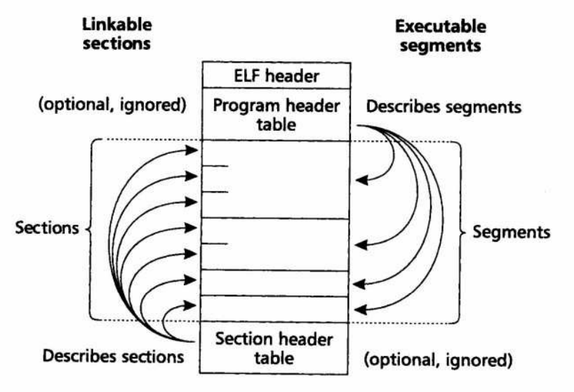

本文的目的是通过计算一个 ELF 文件各部分的**大小**来认识 ELF 文件的组成。

## 基础知识



ELF 文件的主要部分，

- 从链接器的视角来看由`section`组成，每个`section`的信息记录在 ELF 文件尾部的`section header table`部分
- 从加载器的视角（即执行视角）来看由`segment`组成，每个`segment`的信息记录在 ELF 文件头部的`program header table`部分

## ELF 文件大小计算

```c
int main()
{
    return 0;
}
```

使用`gcc -o test test.c`编译上面的 c 文件，并用`ls -l`查看文件的大小（在作者的电脑上是 15832 字节）

使用`readelf -h test`可得知 ELF header 的相关信息

```plain
ELF Header:
  Magic:   7f 45 4c 46 02 01 01 00 00 00 00 00 00 00 00 00 
  Class:                             ELF64
  Data:                              2's complement, little endian
  Version:                           1 (current)
  OS/ABI:                            UNIX - System V
  ABI Version:                       0
  Type:                              DYN (Position-Independent Executable file)
  Machine:                           Advanced Micro Devices X86-64
  Version:                           0x1
  Entry point address:               0x1040
  Start of program headers:          64 (bytes into file)
  Start of section headers:          13912 (bytes into file)
  Flags:                             0x0
  Size of this header:               64 (bytes)
  Size of program headers:           56 (bytes)
  Number of program headers:         13
  Size of section headers:           64 (bytes)
  Number of section headers:         30
  Section header string table index: 29
```

本文只关注**大小**，由`Size of this header`可以得知`ELF header`的大小是 64 字节

program header table 应该紧随 ELF header 之后，那么其相对于 ELF 文件起始处的偏移应该也是 64 字节，`Start of program headers`一项可以验证此结论

program header table 里存放了多条 program header，每条 program header 都存放着每个`segment`的元数据。在本例中，由`Size of program headers`与`Number of program headers`可知 program header table 一共有 13 条，每一条的大小是 56 字节。即整个表的大小为 13 * 56 = 728 字节。

`sections`部分，或`segments`部分，应当紧随 program header table 之后，所以推测其起始偏移应该是 64 + 728 = 792 字节处

使用`readelf -S -W test`命令，获得如下内容：

```plain
Section Headers:
  [Nr] Name              Type            Address          Off    Size   ES Flg Lk Inf Al
  [ 0]                   NULL            0000000000000000 000000 000000 00      0   0  0
  [ 1] .interp           PROGBITS        0000000000000318 000318 00001c 00   A  0   0  1
  [ 2] .note.gnu.property NOTE           0000000000000338 000338 000020 00   A  0   0  8
  [ 3] .note.gnu.build-id NOTE           0000000000000358 000358 000024 00   A  0   0  4
  [ 4] .note.ABI-tag     NOTE            000000000000037c 00037c 000020 00   A  0   0  4
  [ 5] .gnu.hash         GNU_HASH        00000000000003a0 0003a0 000024 00   A  6   0  8
  [ 6] .dynsym           DYNSYM          00000000000003c8 0003c8 000090 18   A  7   1  8
  [ 7] .dynstr           STRTAB          0000000000000458 000458 000088 00   A  0   0  1
  [ 8] .gnu.version      VERSYM          00000000000004e0 0004e0 00000c 02   A  6   0  2
  [ 9] .gnu.version_r    VERNEED         00000000000004f0 0004f0 000030 00   A  7   1  8
  [10] .rela.dyn         RELA            0000000000000520 000520 0000c0 18   A  6   0  8
  [11] .init             PROGBITS        0000000000001000 001000 000017 00  AX  0   0  4
  [12] .plt              PROGBITS        0000000000001020 001020 000010 10  AX  0   0 16
  [13] .plt.got          PROGBITS        0000000000001030 001030 000008 08  AX  0   0  8
  [14] .text             PROGBITS        0000000000001040 001040 0000f4 00  AX  0   0 16
  [15] .fini             PROGBITS        0000000000001134 001134 000009 00  AX  0   0  4
  [16] .rodata           PROGBITS        0000000000002000 002000 000004 04  AM  0   0  4
  [17] .eh_frame_hdr     PROGBITS        0000000000002004 002004 00002c 00   A  0   0  4
  [18] .eh_frame         PROGBITS        0000000000002030 002030 0000ac 00   A  0   0  8
  [19] .init_array       INIT_ARRAY      0000000000003e00 002e00 000008 08  WA  0   0  8
  [20] .fini_array       FINI_ARRAY      0000000000003e08 002e08 000008 08  WA  0   0  8
  [21] .dynamic          DYNAMIC         0000000000003e10 002e10 0001b0 10  WA  7   0  8
  [22] .got              PROGBITS        0000000000003fc0 002fc0 000028 08  WA  0   0  8
  [23] .got.plt          PROGBITS        0000000000003fe8 002fe8 000018 08  WA  0   0  8
  [24] .data             PROGBITS        0000000000004000 003000 000010 00  WA  0   0  8
  [25] .bss              NOBITS          0000000000004010 003010 000008 00  WA  0   0  1
  [26] .comment          PROGBITS        0000000000000000 003010 00001f 01  MS  0   0  1
  [27] .symtab           SYMTAB          0000000000000000 003030 000348 18     28  18  8
  [28] .strtab           STRTAB          0000000000000000 003378 0001c9 00      0   0  1
  [29] .shstrtab         STRTAB          0000000000000000 003541 000110 00      0   0  1
```

重点看 Off(set) 与 Size 两列。offset 是该 section 相对于整个 ELF 文件起始的偏移，第一个有实质内容的 section 是`.interp`，其起始偏移为 0x318，正好对应前文的 792 字节。

随后，看最后的 section `.shstrtab`，其起始偏移为 0x3541，大小为 0x110，即所有 sections 的结束偏移为 0x3541 + 0x110 = 0x3651，即 13905 字节。

section header table 应当紧随 sections 之后，即其起始偏移为 13905 字节。由`Number of section headers`与`Size of section headers`可知，表中有 30 条 section header，每条的大小是 64 字节，所以表的大小是 30 * 64 = 1920 字节。那么整个文件的大小为 13905 + 1920 = 15825 字节。

我们验证一下

```bash
$ du -b test
15832   test
```

咦，实际的大小是 15832 字节。问题在于 ELF 文件的每一部分都是 8 字节对齐的（**TODO**：在哪定的？），所以，虽然 sections 的结束偏移为 13905 字节，但 section header table 应当对齐 8 字节，即应当从 13912 偏移处开始，从 ELF header 中的`Start of section headers`可以验证此结论。

- [elf 文件格式 -1- 可执行文件 - 黄导 - 知乎](https://zhuanlan.zhihu.com/p/363488456)
